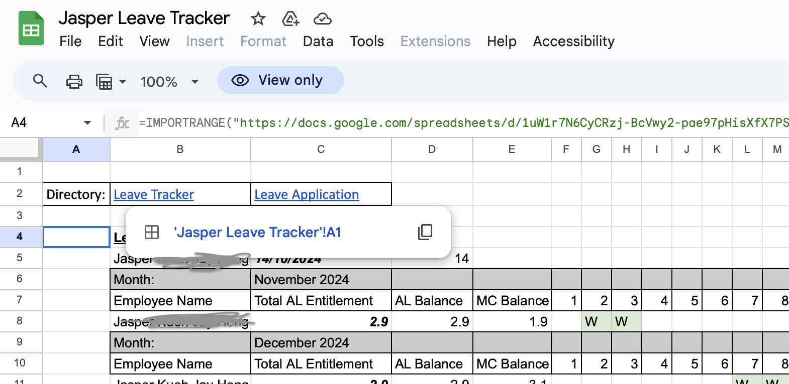

# Excel Leave Tracker (Google Sheets Version)

A customized leave tracker built in **Google Sheets** to automate calculations, streamline reporting, and allow employees to view their own leave balances.

## Problem
Manual leave tracking led to calculation errors, duplicate entries, and time-consuming reporting.

## Solution
Created a Google Sheets tracker with:
- Synchronized sheets for employees
- Automated formulas for leave calculations
- A navigation page for easy access to different accounts

## Tools
- **Google Sheets** (formulas, conditional formatting, linked sheets)
- Basic spreadsheet automation

## Outcome
- Reduced manual errors and duplicate entries
- Enabled employees to track leave status independently
- Streamlined reporting for managers

## Files
- [Excel Leave Tracker](https://docs.google.com/spreadsheets/d/1ZZJeajul9dkDAvFxreRVMuxRSyuhXj9G/edit?gid=943798988#gid=943798988)

## Screenshot

