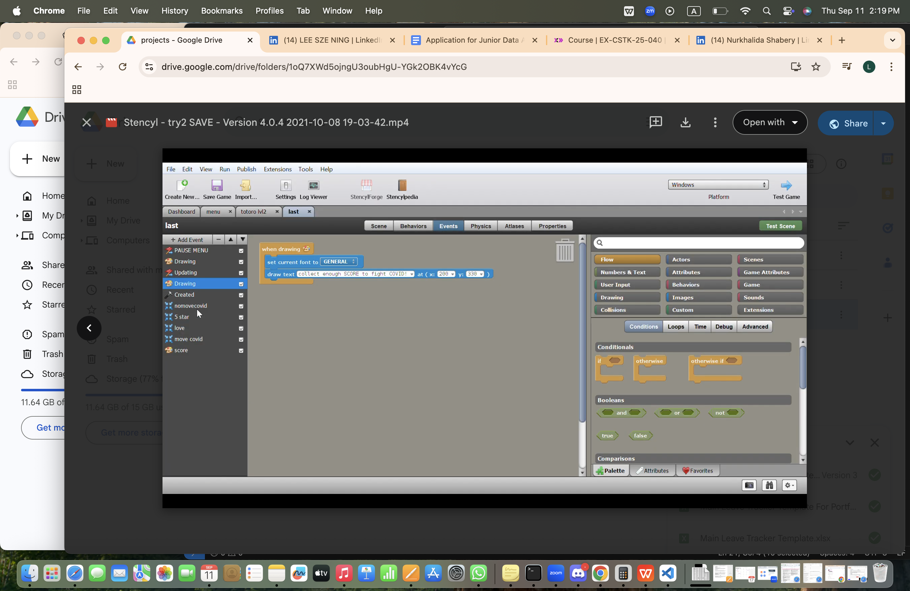

# Platformer Game (2021)

A 2D platformer game built from scratch as a birthday gift for my boy friend, including custom backgrounds and characters. Developed using drag-and-drop game software Stencyl to learn programming logic and game design fundamentals.

## Problem
Wanted to create a meaningful, personalized gift while learning coding logic from zero knowledge, including triggers, conditions, and game flow.

## Solution
- Built the game world from scratch, designing backgrounds, characters, and obstacles.
- Implemented gameplay mechanics and level progression using visual drag-and-drop logic.
- Tested and iterated to ensure smooth gameplay and engaging user experience.

## Tools
- Drag-and-drop game development software
- Custom graphics for characters and backgrounds

## Outcome
- Gained hands-on experience with game logic and design.
- Practiced problem-solving, creativity, and logical thinking through a fun, personal project.

## Screenshoot

.png)
.png)
.png)
.png)
.png)
.png)
.png)

