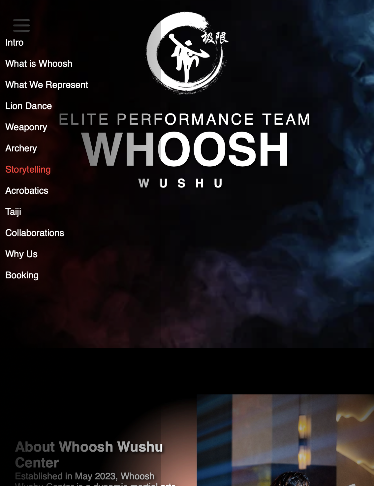

# Whoosh Wushu Center Performance Showcase

## Problem
Whoosh Wushu Center needed a simple, professional way to showcase its performance services to potential clients and event organizers, including Wushu performances, lion dance, and archery, without relying on long PDFs or physical portfolios.

## Solution
Developed a clean, scrollable one-page website that highlights all performances, includes videos, and provides a clear overview of offerings. The design is responsive and visually appealing to engage visitors.

## Tools
- HTML5 & CSS3 for layout and styling  
- JavaScript for interactive elements  
- Videos embedded from Instagram  
- VS Code for development  
- GitHub Pages for hosting  

## Outcome
- Easy-to-navigate website presenting all performance services  
- Embedded videos allow clients to preview performances online  
- Improved client engagement and professional presentation  
- Hosted on GitHub Pages for easy access and sharing  

## Screenshot

## Author
Lee Sze Ning  
Email: lsning98@gmail.com  
GitHub: [https://github.com/leeszening](https://github.com/leeszening)
